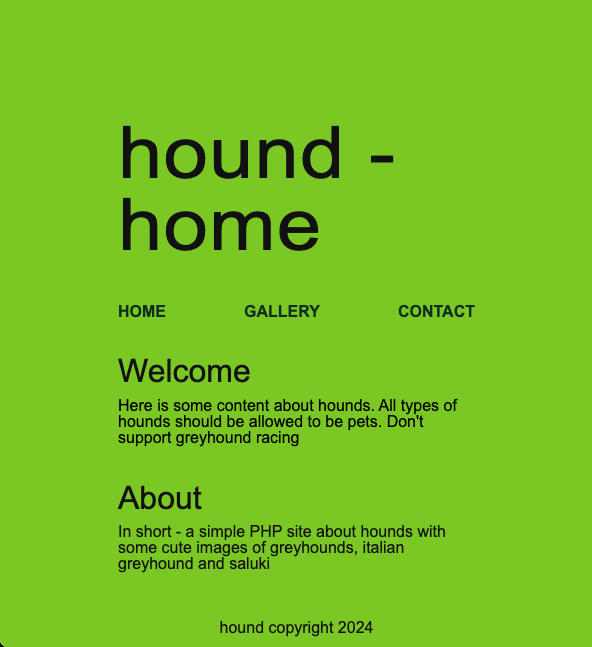
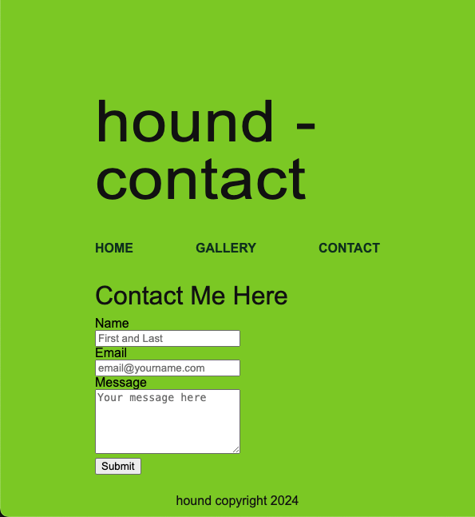

# php template site

## Template System: Using PHP as a Template System

### Requirements

1. Make a simple web site with at least 3 types of pages (you may include a landing page, a
   gallery page and a contact page).
   a. All types shall share a common masthead (Template), header, footer and
   navigation.
2. Make a page controller (index.php), for each page and set the title, heading and other
   data in variables.
3. Make a master template for every type of page that in turn will include the smaller page
   parts. (All data can be considered safe for this exercise, making filtering, and escaping
   unnecessary)
4. As best practice Validate the html source in W3Validator.

## Styling

### Inspired by brat by Charli XCX

